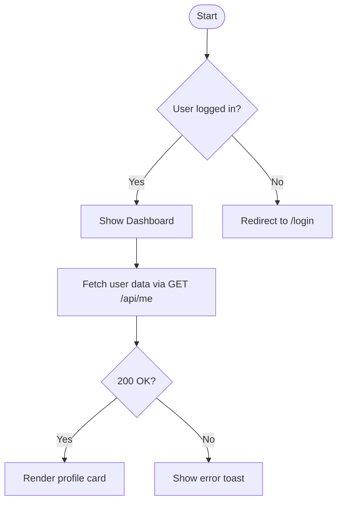

# Agent Skills for Frontend Developers

> Practical Agent Skills for Frontend Developers — Requirements Confirmation Flowchart & Lightweight Test Report Generator, compatible with Claude Code / Qoder / Codex / Cursor and 40+ coding tools.

[中文文档](./README.zh-CN.md) · [MIT License](./LICENSE)

---

## Overview

This repository provides two ready-to-use **Agent Skills** designed specifically for frontend developers:

| Skill | Description |
|---|---|
| [`confirm-requirements`](./skills/confirm-requirements/SKILL.md) | Guides the AI to ask clarifying questions before coding, and renders an interactive Mermaid flowchart summarising the confirmed requirements |
| [`gen-test-report`](./skills/gen-test-report/SKILL.md) | Generates a structured, lightweight pre-release test report (提测单) from a feature description or diff |

Both skills are plain Markdown files — no plugins, no runtime dependencies, no configuration needed.

---

## Repository Structure

```
agent-skills/
├── README.md                          # English documentation (this file)
├── README.zh-CN.md                    # Chinese documentation
├── LICENSE                            # MIT
└── skills/
    ├── confirm-requirements/
    │   └── SKILL.md                   # Requirements confirmation + Mermaid flowchart
    └── gen-test-report/
        └── SKILL.md                   # Lightweight test report generator
```

---

## Quick Start

### 1. Copy the skill into your project (recommended)

```bash
# Clone the repo
git clone https://github.com/your-org/agent-skills.git

# Copy the skill(s) you need
cp agent-skills/skills/confirm-requirements/SKILL.md ./SKILL.md
```

Then reference it in your AI tool's system prompt or context window.

### 2. Reference directly via URL

Paste the raw URL of any `SKILL.md` into your tool's **Custom Instructions** / **System Prompt** field:

```
https://raw.githubusercontent.com/your-org/agent-skills/main/skills/confirm-requirements/SKILL.md
```

### 3. Use as a slash command (Claude Code / Cursor)

Add the following to `.claude/commands/confirm.md` or `.cursor/rules`:

```
@file:./skills/confirm-requirements/SKILL.md
```

---

## Compatibility

Tested with the following tools (and compatible with any tool that accepts a Markdown system prompt):

| Category | Tools |
|---|---|
| **AI Coding Agents** | Claude Code, Cursor, Copilot Chat, Qoder, Codex, Devin, SWE-agent |
| **Chat / API** | ChatGPT, Claude.ai, Gemini, Mistral, DeepSeek, Kimi |
| **IDE Extensions** | GitHub Copilot, Cody, Continue, Tabby, Aider |
| **Self-hosted** | Ollama + Open-WebUI, LM Studio, Jan |

> **Total: 40+ tools supported** — if your tool supports a system prompt or custom instructions in Markdown, it works.

---

## Skill Details

### `confirm-requirements` — Requirements Confirmation Flowchart

**Purpose:** Prevent wasted effort caused by ambiguous requirements. Before writing a single line of code the agent will:

1. Ask targeted clarifying questions (UI behaviour, edge cases, data flow, acceptance criteria)
2. Summarise the confirmed requirements as a **Mermaid flowchart** embedded in the response
3. Await explicit approval before proceeding

**Example output:**



---

### `gen-test-report` — Lightweight Test Report Generator

**Purpose:** Produce a structured pre-release test report (提测单) that QA and reviewers can act on immediately, covering:

- Feature summary & scope
- Environment & version information
- Test cases (happy path + edge cases)
- Risk areas & regression points
- Deploy checklist

**Example output (abbreviated):**

```
## 提测单 · Login Feature v2.3

| Field        | Value                        |
|--------------|------------------------------|
| Feature      | Password-free login via OTP  |
| Branch       | feat/otp-login               |
| Test Env     | staging.example.com          |
| Submitted by | AI Agent                     |

### Test Cases
- [ ] TC-01  Enter valid phone → receive OTP → login success
- [ ] TC-02  Enter invalid OTP → show error, allow retry
- [ ] TC-03  OTP expires (5 min) → prompt re-send
...
```

---

## Contributing

Pull requests are welcome! Please:

1. Fork the repo and create a feature branch
2. Follow the existing SKILL.md format
3. Add both English and Chinese descriptions
4. Open a PR with a clear summary

---

## License

[MIT](./LICENSE) © 2025 Agent Skills Contributors
