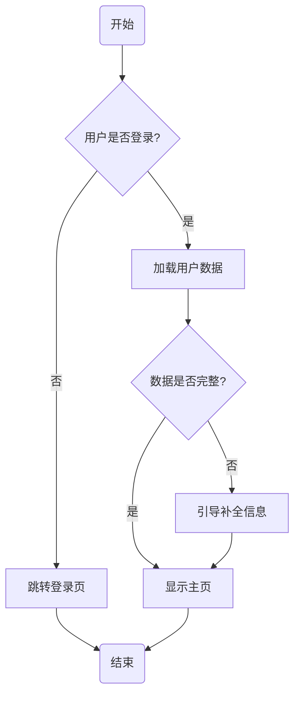

# Agent Skills for Frontend Developers

> Practical Agent Skills for Frontend Developers — Requirements Confirmation & Lightweight Test Report Generator, compatible with Claude Code / Qoder / Codex / Cursor and 40+ coding tools.

[中文文档](./README.zh-CN.md) · [MIT License](./LICENSE)

---

## Skills

| Skill | Slash Command | Description |
|---|---|---|
| [`confirm-requirements`](./skills/confirm-requirements/SKILL.md) | `/confirm-requirements [功能描述]` | Acts as a senior PM/analyst. Asks structured questions before coding, then outputs a requirements doc + Mermaid flowchart saved to `docs/requirements/`. |
| [`gen-test-report`](./skills/gen-test-report/SKILL.md) | `/gen-test-report [可选备注]` | Scans the current conversation, extracts what changed and how to test it, then writes a ready-to-hand-off test report to `docs/test-reports/`. |

---

## Installation

### Any agent (recommended)

```bash
# Install all skills
npx skills add your-github-name/agent-skills

# Install a single skill
npx skills add your-github-name/agent-skills --skill confirm-requirements
npx skills add your-github-name/agent-skills --skill gen-test-report

# Install to specific agents
npx skills add your-github-name/agent-skills -a claude-code -a qoder -a codex
```

### Manual installation

Copy the skill folder to your agent's skills directory:

| Agent | Path |
|-------|------|
| Claude Code | `.claude/skills/` |
| Qoder | `.qoder/skills/` |
| Codex | `.agents/skills/` |
| Cursor | `.agents/skills/` |
| Windsurf | `.windsurf/skills/` |

---

## Repository Structure

```
agent-skills/
├── README.md                          # English documentation (this file)
├── README.zh-CN.md                    # Chinese documentation
├── LICENSE                            # MIT
└── skills/
    ├── confirm-requirements/
    │   └── SKILL.md                   # Requirements confirmation + Mermaid flowchart
    └── gen-test-report/
        └── SKILL.md                   # Lightweight test report generator
```

---

## Skill Details

### `confirm-requirements` — Requirements Confirmation + Flowchart

**Trigger:** `/confirm-requirements [feature description]`

**What it does:**

The agent adopts the role of a senior product manager and system analyst. It will not write any code until requirements are locked. The workflow:

1. **Summarise** its understanding of your request in 2–3 sentences
2. **Ask up to 5 targeted questions** per round, covering:
   - Functional boundaries (what's in scope / explicitly out)
   - Edge cases & exceptions (network errors, empty states, concurrency, permissions)
   - Entry & exit points (where users come from, where they go after)
   - Non-functional requirements (performance, compatibility, i18n, accessibility)
   - External dependencies (APIs, third-party services, DB tables)
3. **Generate a requirements document** saved to `docs/requirements/{feature-name}.md`, including a checklist of feature points, edge-case table, and confirmation status
4. **Append a Mermaid flowchart** (≤ 15 nodes, `flowchart TD`) to the same file
5. **Request final sign-off** — only outputs `✅ 需求已确认，可以开始开发` after explicit confirmation

**Example flowchart output:**



---

### `gen-test-report` — Lightweight Test Report Generator

**Trigger:** `/gen-test-report [optional notes]`

**What it does:**

The agent reads the current conversation as a developer handing off to QA — no technical jargon, just clear steps any tester can follow. The workflow:

1. **Scan the conversation** for what was built or changed, which pages/modules are involved, and any special logic or known risks discussed
2. **Translate changes into plain test steps** in the format: *open X → do Y → expect Z*
3. **Write a test report** to `docs/test-reports/{feature-name}-{YYYYMMDD}.md`, containing:
   - Basic info (feature name, date, developer, branch)
   - Plain-language summary of changes
   - Step-by-step test table
   - Things to watch out for (edge cases, known risks)
   - Extra notes from `$ARGUMENTS`
4. **Ask for confirmation**, then outputs `✅ 提测单已生成`

**Design principles:**
- One screen long — no bloat
- Zero tech terms in test steps (no API paths, no code snippets)
- Missing info is marked `待补充`, never fabricated

---

## Compatibility

Both skills have a `disable-model-invocation: true` frontmatter flag — they activate only when explicitly called via slash command, never running in the background.

Compatible with any agent that supports slash commands or Markdown skill files:

| Category | Tools |
|---|---|
| **AI Coding Agents** | Claude Code, Qoder, Codex, Cursor, Devin, SWE-agent |
| **IDE Extensions** | GitHub Copilot Chat, Cody, Continue, Windsurf |
| **Chat / API** | ChatGPT, Claude.ai, Gemini, DeepSeek, Kimi |
| **Self-hosted** | Ollama + Open-WebUI, LM Studio, Jan |

> **40+ tools supported** — if your agent supports Markdown skill files or slash commands, it works.

---

## Contributing

Pull requests are welcome! Please:

1. Fork the repo and create a feature branch
2. Follow the YAML frontmatter convention (`name`, `description`, `disable-model-invocation`, `argument-hint`)
3. Add both English and Chinese documentation
4. Open a PR with a clear summary

---

## License

[MIT](./LICENSE) © 2025 Agent Skills Contributors
