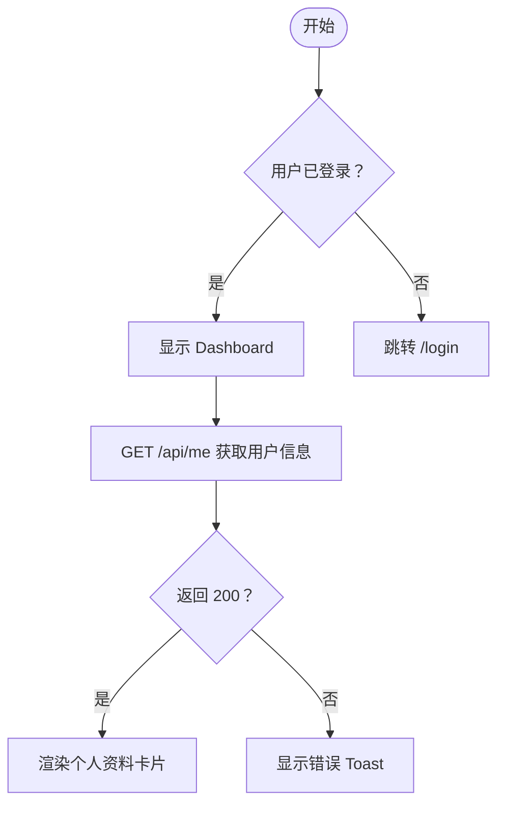

# 面向前端开发者的实用 Agent Skills —— 需求确认流程图 & 轻量提测单生成器，兼容 Claude Code / Qoder / Codex / Cursor 等 40+ 编码工具。

[English](./README.md) · [MIT 许可证](./LICENSE)

---

## 简介

本仓库提供两个开箱即用的 **Agent Skills**，专为前端开发者设计：

| Skill | 说明 |
|---|---|
| [`confirm-requirements`](./skills/confirm-requirements/SKILL.md) | 引导 AI 在写代码前主动追问需求，并将确认结果渲染为可视化的 Mermaid 流程图 |
| [`gen-test-report`](./skills/gen-test-report/SKILL.md) | 根据功能描述或 diff，自动生成结构化的轻量提测单 |

两个 Skill 均为纯 Markdown 文件，无需插件、无需运行时依赖、无需额外配置。

---

## 目录结构

```
agent-skills/
├── README.md                          # 英文说明
├── README.zh-CN.md                    # 中文说明（本文件）
├── LICENSE                            # MIT
└── skills/
    ├── confirm-requirements/
    │   └── SKILL.md                   # 需求确认 + Mermaid 流程图
    └── gen-test-report/
        └── SKILL.md                   # 轻量提测单生成器
```

---

## 快速上手

### 方式一：复制 Skill 文件到项目（推荐）

```bash
# 克隆仓库
git clone https://github.com/your-org/agent-skills.git

# 复制所需 Skill
cp agent-skills/skills/confirm-requirements/SKILL.md ./SKILL.md
```

然后在 AI 工具的系统提示词或上下文窗口中引用该文件即可。

### 方式二：直接使用原始 URL

将任意 `SKILL.md` 的 Raw URL 粘贴到工具的 **自定义指令 / System Prompt** 输入框：

```
https://raw.githubusercontent.com/your-org/agent-skills/main/skills/confirm-requirements/SKILL.md
```

### 方式三：作为斜杠命令使用（Claude Code / Cursor）

在 `.claude/commands/confirm.md` 或 `.cursor/rules` 中添加：

```
@file:./skills/confirm-requirements/SKILL.md
```

---

## 兼容性

已在以下工具中测试，兼容所有支持 Markdown 系统提示词的工具：

| 分类 | 工具 |
|---|---|
| **AI 编码智能体** | Claude Code、Cursor、Copilot Chat、Qoder、Codex、Devin、SWE-agent |
| **对话 / API** | ChatGPT、Claude.ai、Gemini、Mistral、DeepSeek、Kimi |
| **IDE 插件** | GitHub Copilot、Cody、Continue、Tabby、Aider |
| **本地部署** | Ollama + Open-WebUI、LM Studio、Jan |

> **共计支持 40+ 工具** —— 只要你的工具支持系统提示词或自定义指令（Markdown 格式），即可使用。

---

## Skill 详解

### `confirm-requirements` —— 需求确认流程图

**目的：** 防止因需求不清晰导致的无效返工。在写任何代码之前，Agent 会：

1. 提出针对性的澄清问题（UI 行为、边界情况、数据流、验收标准）
2. 将确认后的需求汇总为嵌入在回复中的 **Mermaid 流程图**
3. 等待明确的确认再继续开发

**输出示例：**



---

### `gen-test-report` —— 轻量提测单生成器

**目的：** 生成结构化的提测单，让 QA 和 Reviewer 可立即执行，涵盖：

- 功能概述与范围
- 环境与版本信息
- 测试用例（主流程 + 边界场景）
- 风险点与回归影响
- 上线检查清单

**输出示例（节选）：**

```
## 提测单 · 登录功能 v2.3

| 字段     | 内容                         |
|----------|------------------------------|
| 功能     | 手机验证码免密登录           |
| 分支     | feat/otp-login               |
| 测试环境 | staging.example.com          |
| 提测人   | AI Agent                     |

### 测试用例
- [ ] TC-01  输入有效手机号 → 收到验证码 → 登录成功
- [ ] TC-02  输入无效验证码 → 报错提示，允许重试
- [ ] TC-03  验证码过期（5 分钟）→ 提示重新发送
...
```

---

## 参与贡献

欢迎提交 Pull Request！请遵循以下步骤：

1. Fork 本仓库并创建功能分支
2. 遵循现有 `SKILL.md` 格式规范
3. 同时提供中英文说明
4. 提交 PR 并附上清晰的变更摘要

---

## 许可证

[MIT](./LICENSE) © 2025 Agent Skills Contributors
