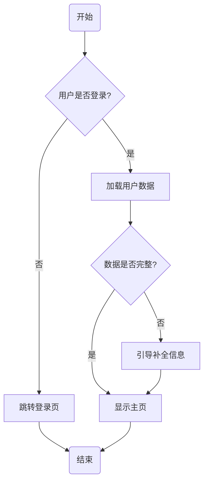

# 面向前端开发者的实用 Agent Skills —— 需求确认流程图 & 轻量提测单生成器，兼容 Claude Code / Qoder / Codex / Cursor 等 40+ 编码工具。

[English](./README.md) · [MIT 许可证](./LICENSE)

---

## Skills 列表

| Skill | 斜杠命令 | 说明 |
|---|---|---|
| [`confirm-requirements`](./skills/confirm-requirements/SKILL.md) | `/confirm-requirements [功能描述]` | 扮演资深产品经理，写代码前先追问需求，输出需求确认文档 + Mermaid 流程图，保存至 `docs/requirements/` |
| [`gen-test-report`](./skills/gen-test-report/SKILL.md) | `/gen-test-report [可选备注]` | 扫描当前对话，提取变更内容，用大白话生成可直接交付给测试的提测单，保存至 `docs/test-reports/` |

---

## 安装方式

### 通过 npx 安装（推荐）

```bash
# 安装全部 skills
npx skills add your-github-name/agent-skills

# 安装单个 skill
npx skills add your-github-name/agent-skills --skill confirm-requirements
npx skills add your-github-name/agent-skills --skill gen-test-report

# 安装到指定 agent
npx skills add your-github-name/agent-skills -a claude-code -a qoder -a codex
```

### 手动安装

将对应的 skill 文件夹复制到你的 agent skills 目录：

| Agent | 路径 |
|-------|------|
| Claude Code | `.claude/skills/` |
| Qoder | `.qoder/skills/` |
| Codex | `.agents/skills/` |
| Cursor | `.agents/skills/` |
| Windsurf | `.windsurf/skills/` |

---

## 目录结构

```
agent-skills/
├── README.md                          # 英文说明
├── README.zh-CN.md                    # 中文说明（本文件）
├── LICENSE                            # MIT
└── skills/
    ├── confirm-requirements/
    │   └── SKILL.md                   # 需求确认 + Mermaid 流程图
    └── gen-test-report/
        └── SKILL.md                   # 轻量提测单生成器
```

---

## Skill 详解

### `confirm-requirements` —— 需求确认 + 流程图

**触发方式：** `/confirm-requirements [功能描述]`

**工作流程：**

Agent 扮演资深产品经理和系统分析师角色，在需求未明确之前不会写任何代码：

1. **总结理解** —— 用 2-3 句话复述对需求的理解
2. **结构化提问** —— 每轮最多 5 个问题，覆盖：
   - 功能边界（哪些在范围内，哪些明确不做）
   - 异常与边界条件（网络异常、空数据、并发、权限不足）
   - 入口与出口（用户从哪里进入，完成后去哪里）
   - 非功能需求（性能、兼容性、国际化、无障碍）
   - 外部依赖（对接的 API、第三方服务、数据库表）
3. **生成需求文档** —— 保存至 `docs/requirements/{功能名称}.md`，包含功能点清单、边界处理表、确认状态
4. **追加 Mermaid 流程图** —— 同文件末尾，节点数 ≤ 15，`flowchart TD` 格式
5. **请求最终确认** —— 用户明确确认后才输出 `✅ 需求已确认，可以开始开发`

**流程图示例：**



---

### `gen-test-report` —— 轻量提测单生成器

**触发方式：** `/gen-test-report [可选备注]`

**工作流程：**

Agent 扮演对接测试的开发人员，从对话中提取变更内容，用测试人员能直接看懂的语言输出提测单：

1. **回顾对话** —— 找出做了什么功能、涉及哪些页面/模块、有无特殊逻辑或风险点
2. **转化为操作步骤** —— 格式为"在哪里 → 做什么 → 应该看到什么"，不写技术术语
3. **输出提测单** —— 保存至 `docs/test-reports/{功能名称}-{YYYYMMDD}.md`，包含：
   - 基本信息（功能名称、日期、开发人员、分支）
   - 大白话变更说明
   - 可执行的测试步骤表
   - 需要注意的地方（边界场景、已知风险）
   - `$ARGUMENTS` 中的额外备注
4. **确认后输出** `✅ 提测单已生成`

**设计原则：**
- 一屏看完，不冗长
- 测试步骤零技术术语（不写接口路径、不写代码）
- 对话中没提到的信息标注「待补充」，不编造

---

## 兼容性

两个 Skill 均在 YAML frontmatter 中设置了 `disable-model-invocation: true`，仅在显式调用斜杠命令时触发，不会在后台静默运行。

兼容所有支持斜杠命令或 Markdown skill 文件的 Agent：

| 分类 | 工具 |
|---|---|
| **AI 编码智能体** | Claude Code、Qoder、Codex、Cursor、Devin、SWE-agent |
| **IDE 插件** | GitHub Copilot Chat、Cody、Continue、Windsurf |
| **对话 / API** | ChatGPT、Claude.ai、Gemini、DeepSeek、Kimi |
| **本地部署** | Ollama + Open-WebUI、LM Studio、Jan |

> **共计支持 40+ 工具** —— 只要你的 Agent 支持 Markdown skill 文件或斜杠命令即可使用。

---

## 参与贡献

欢迎提交 Pull Request！请遵循以下步骤：

1. Fork 本仓库并创建功能分支
2. 遵循 YAML frontmatter 规范（`name`、`description`、`disable-model-invocation`、`argument-hint`）
3. 同时提供中英文说明
4. 提交 PR 并附上清晰的变更摘要

---

## 许可证

[MIT](./LICENSE) © 2025 Agent Skills Contributors
